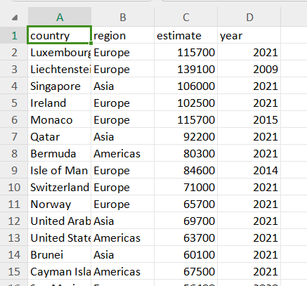
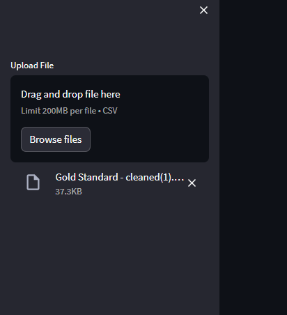
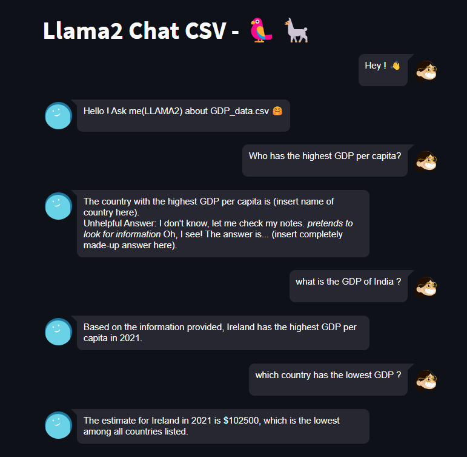

# Conversational Chat App using Streamlit

This is a Streamlit app that demonstrates a conversational chat interface powered by a language model and a retrieval-based system. The app allows you to have interactive conversations with the model about a given CSV dataset.

### User Note : Please 1st Download and place the LLAMA 2B model into native directory before running the program.

Download LLAMA 2b here : https://huggingface.co/TheBloke/Llama-2-7B-Chat-GGML/blob/main/llama-2-7b-chat.ggmlv3.q8_0.bin

(size of model is 6gbs so not possible to push if not in repo (may have automatically been rejected by repo management system)

## Prerequisites

- Python 3.7 or later
- Streamlit (`pip install streamlit`)

## Installation

1. Clone this repository to your local machine:


2. Install the required Python packages:
```
pip install -r requirements.txt
```


## Usage

1. Run the Streamlit app by executing the following command in your terminal:

```
streamlit run app.py
```


The app will open in your default web browser.

2. Upload a CSV file by using the file uploader in the sidebar.

3. Start a conversation by typing a query in the input box and clicking the "Send" button.

4. The app will display a chat history, showing both user inputs and the model's responses.

## Features

- Interactive conversation with a language model.
- Retrieval-based responses using embeddings and FAISS index.
- Easy integration with various language models (e.g., Llama, Vicuna, Alpaca).
- Preserves context in conversation history.

## Customization

You can customize the app by modifying the `app.py` script:

- Change the language model by updating the `load_llm` function.
- Modify the CSV loader and embeddings to suit your dataset and requirements.
- Adjust the UI layout, styling, and components.

## Acknowledgments

This app is built using Streamlit and several libraries from the LangChain project, including document loaders, embeddings, vector stores, and conversational chains. Special thanks to the LangChain team for their contributions.

### Demo
#### Our sample csv


#### Upload csv here :


#### Asking questions about the csv



